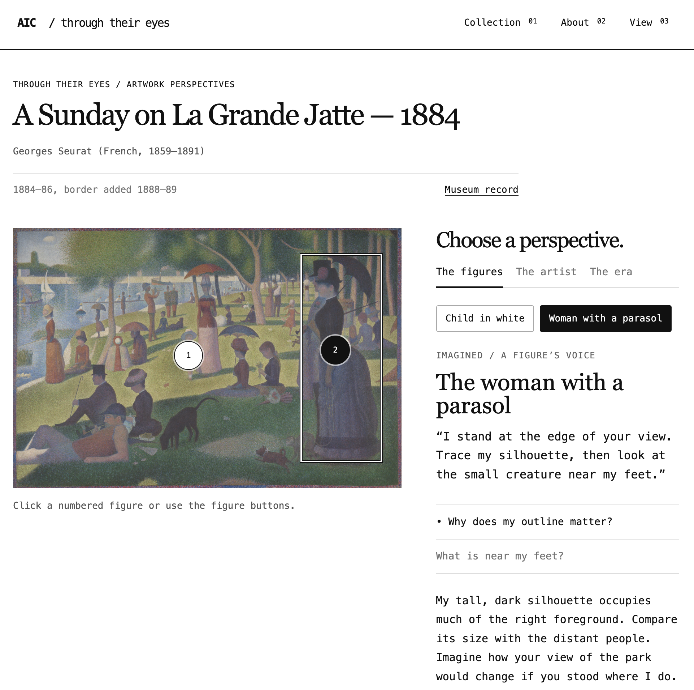

# Day 1 "before" snapshot

Write your own, even if you worked in a pair. Keep it: we come back to it at mid-quarter (Week 6) and at the end (Week 11). Your prompts go in `ai_log.md`, not here.

**Name: Shawn Yin**
**Partner (if any): Esther**

## Before we prompted

### 1. Who is it for, and what do they want to do?

It’s for museum visitors who want to explore artworks and understand them through different perspectives, including the artist, figures in the artwork, and historical context.

**"The user can..." sentences:**
1. The user can browse artworks in a grid or scattered layout, search for a specific work, and select it to learn more.
2. The user can switch perspectives and click questions or highlighted figures to explore different interpretations of an artwork.

### 2. Our sketch

Put the photo in this `hw0` folder, then change the filename below to match: We did not start with a sketch.

### 3. Our prediction

We expected the app would show real artworks from the Art Institute of Chicago and let users select a painting to explore. We imagined that clicking different perspectives would change the story or information displayed beside the painting. We expected to need several revisions to get the layout and interactions right.

## What we got

### 4. What the AI made

Put the screenshot in this `hw0` folder, then change the filename below to match:

### 5. Sketch vs. app

- **Matches our sketch:**
- **Different from our sketch:**
- **The AI decided** (something we never said):

### 6. What did I keep, change, or reject, and why?

### 7. Explain back

Pick one part of the code. In your own words, what does it do?

One part of the code controls perspective switching. When a user clicks a perspective button, the code remembers the selected perspective and resets the selected question. It then updates the title, explanation, questions, and active button.

## Looking ahead

### 8. What does it do? Does it work? What broke?

The app lets visitors browse and search real museum artworks, open an artwork, and explore different perspectives.

During development, perspective switching was not working as intended. The controls were unavailable for some artworks, and a problem in the code prevented the figure stories from appearing correctly. The AI revised the interface and fixed that problem.

The prototype now supports those interactions, but its storytelling is still limited. Only two artworks have custom character perspectives. Other artworks use general viewing prompts and museum metadata.

### 9. How much do I understand about how it works? (0–100%)

**My number: 50%**

**Why that number:**

I understand the overall flow: the app requests artwork information from the museum API, displays it, and updates the page when someone searches or clicks a perspective. I can explain the purpose of some functions, but I still need help understanding how the code handles loading, errors, and different interface states.

### 10. What would I need to know to tell whether it's *well designed or well built*?

To judge the design, I would need to see whether visitors can find artworks and understand the perspective controls without help. I would also want to know whether the stories encourage closer observation and whether users can distinguish historical facts from imagined interpretations.

To judge how well it is built, I would need to check whether search and navigation work consistently, what happens when images or information fail to load, and whether the app works on phones and with keyboard navigation.

### 11. What do I hope to be able to do by week 10?

By week 10, I hope to turn an idea and sketch into an interactive app more independently. I want to understand enough python, HTML, CSS, and JavaScript to change the interface, connect an API, and debug basic problems. I also want to better use AI to generate code and design decisions.